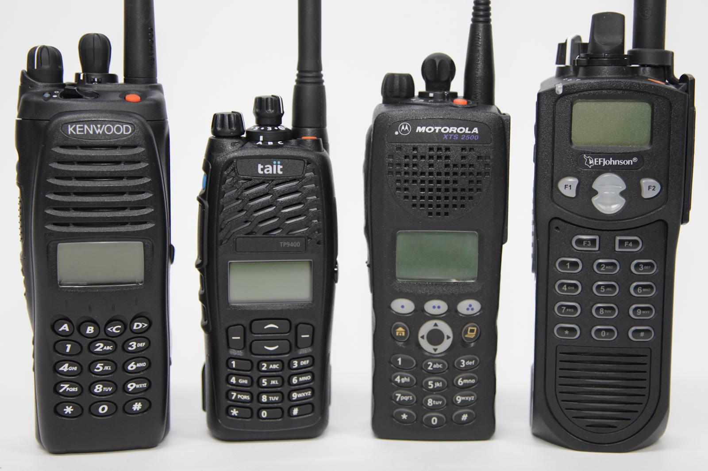

WPD Radio Tracking - built by Thomas Martinez

- Will need to move MongoDB from personal account to work account

- Referenced https://www.youtube.com/watch?v=7CqJlxBYj-M

- Dependencies installed

  - [ ] Express
    - Lightweight framework for Nodejs
  - [ ] Cors
    - Cross Origin Resource Sharing is a node.js package for providing a Connect/Express middleware that can be used to enable CORS with various options. Access to outside server from server
  - [ ] Mongoose
    - Interacting with MongoDB
  - [ ] Dotenv
    - Dotenv is a zero-dependency module that loads environment variables from a .env file into process.env. Storing configuration in the environment separate from code is based on The Twelve-Factor App methodology.
  - [ ] Nodemon
    - Nodemon is a tool that helps develop node.js based applications by automatically restarting the node application when file changes in the directory are detected.

- Main screen: two toggles (Mobile - Vehicle or Portable - Office)
- List: Model, Serial, MDCID, Officer/Car, Date Issued

- [ ] Landing Page:
  - [ ] Mobile (Vehicle)
  - [ ] Portable (Officer)
- [ ] List:
  - [ ] Model
  - [ ] Serial
  - [ ] MDCID
  - [ ] Assigned To
  - [ ] Date Issued

